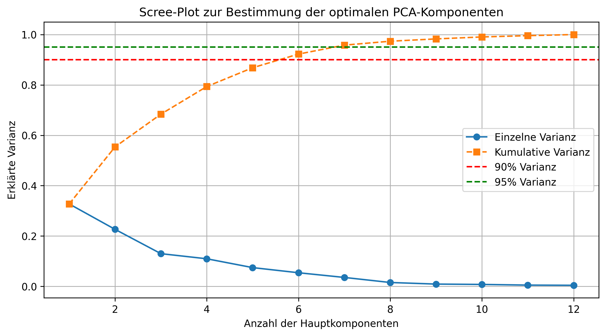

TravelTide – Customer Segmentation & Perk Strategy

This project demonstrates an end-to-end customer segmentation analysis using PCA and HDBSCAN, followed by a simulated perk recommendation strategy.  
It is based on a dataset from the TravelTide Mastery Project and has been adapted for public viewing — all results are reproducible from a sample CSV.

---

Project Overview

- Goal: Segment users into behavioral groups and simulate perk strategies based on booking patterns.  
- Techniques:  
  - Principal Component Analysis (PCA) for dimensionality reduction  
  - HDBSCAN clustering for user segmentation  
  - Visualization of customer behavior and perk performance  
- Tools: Python, Pandas, Scikit-learn, Seaborn, Matplotlib

---

Key Visualizations

| Visualization | Description |
|----------------|-------------|
| PCA Scree Plot | Shows variance explained by each principal component |
| Cluster Heatmap | Displays cluster-level feature averages across key behavioral metrics |
| Simulated Booking Rate per Perk | Illustrates how perks might influence conversion rates |

